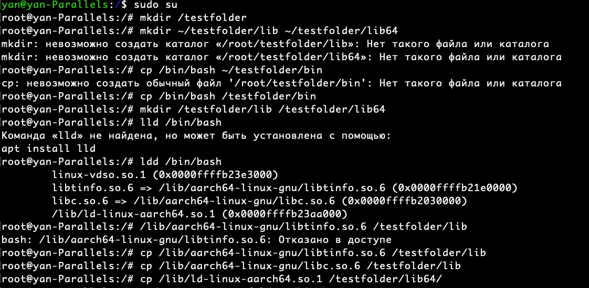
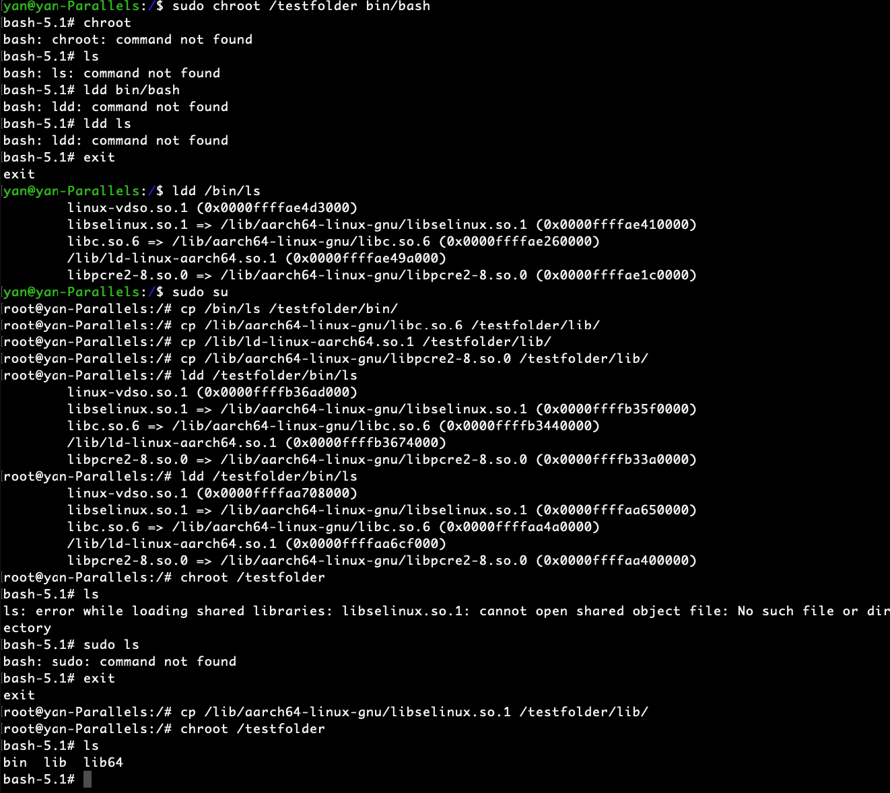
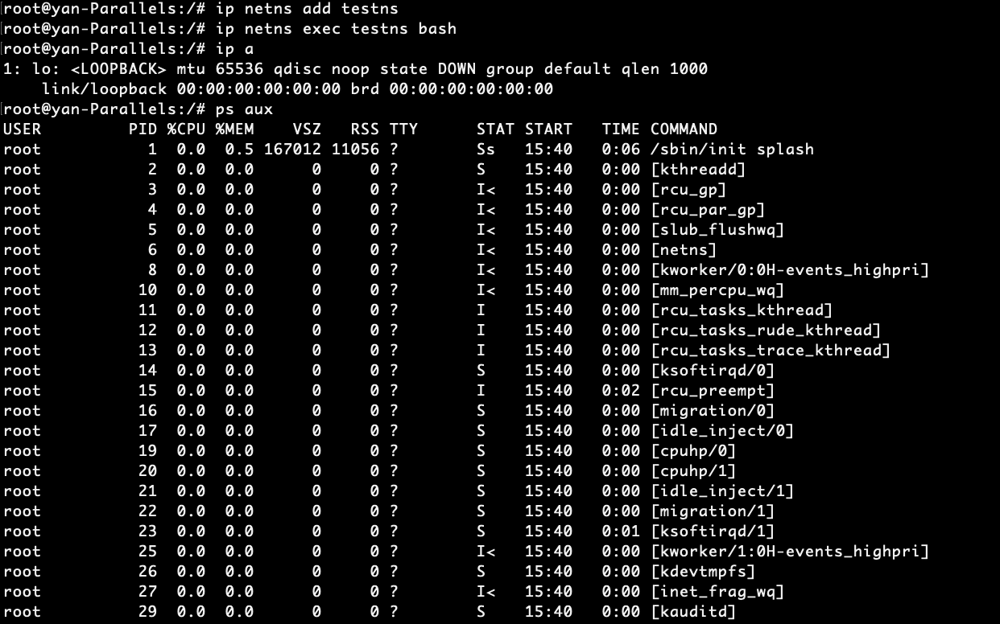
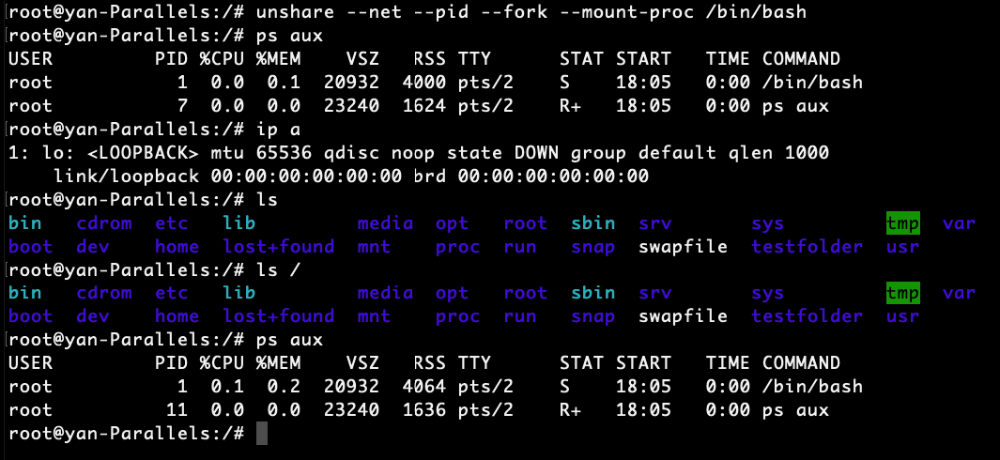

# Изолированное выполнение процессов с помощью chroot и пространства имен в Linux

## Подготовка к использованию chroot:

Для начала, создадим каталог "testfolder" в домашнем каталоге пользователя и скопируем необходимые исполняемые файлы и библиотеки в эту папку:

```
mkdir /testfolder
cp /bin/bash /testfolder/bin
mkdir /testfolder/lib /testfolder/lib64
cp /lib/aarch64-linux-gnu/libtinfo.so.6 /testfolder/lib
cp /lib/aarch64-linux-gnu/libc.so.6 /testfolder/lib
cp /lib/ld-linux-aarch64.so.1 /testfolder/lib64/
```
 

# Запуск команды chroot:

Запустим команду chroot для изменения корневой папки нашей текущей среды:
```
sudo chroot /testfolder /bin/bash
```

Изменение корневой папки:

Теперь мы находимся в изолированной среде с корнем, отличным от основной файловой системы. Оболочка интерпретатора Bash запущена в этой изолированной среде.

ls
В этот момент вы можете заметить ошибку:
```
bash: ls: command not found
```
Это произошло потому, что необходимо также скопировать исполняемые файлы, такие как "ls", и связанные с ними библиотеки в созданный каталог.

Добавление дополнительных файлов:

Для решения проблемы с отсутствием команды "ls" и других, продолжим копировать необходимые файлы:
```
cp /bin/ls /testfolder/bin/
cp /lib/aarch64-linux-gnu/libc.so.6 /testfolder/lib/
cp /lib/ld-linux-aarch64.so.1 /testfolder/lib/
cp /lib/aarch64-linux-gnu/libselinux.so.1 /testfolder/lib/
cp /lib/aarch64-linux-gnu/libpcre2-8.so.0 /testfolder/lib/
```
Подготовка для запуска:

Теперь мы можем выполнить следующие команды для убедиться, что все необходимые файлы скопированы:
```
ldd /testfolder/bin/ls
```
Использование chroot с дополнительными файлами:

Попробуем снова войти в изолированную среду через chroot:
```
chroot /testfolder
```

Теперь вы должны видеть изменение приветствия оболочки, что означает успешное выполнение команды chroot.

Выполните:
_
ls /
Вы увидите, что теперь команда "ls" работает.


# Пространство имен:

Однако стоит отметить, что использование chroot имеет недостатки, такие как необходимость дублирования всех необходимых файлов. Вместо этого, можно рассмотреть использование механизма пространства имен.

Пространство имен в Linux обеспечивает изоляцию процессов друг от друга, и может быть более эффективным способом управления изоляцией и ресурсами.

Вышеупомянутые инструменты, такие как Docker, также предоставляют более надежные и гибкие средства для изоляции процессов и управления ресурсами.

Пример использования сетевого пространства имен:

Создание Пространства Имен для Сети:

Воспользуемся командой ip для создания сетевого пространства имен. Давайте создадим пространство имен с именем "testns":
```
ip netns add testns
```
Это создаст изолированное сетевое окружение, похожее на свитч, к которому можно подключить процессы.

## Запуск Процесса в Пространстве Имен:

Используя команду ip, мы можем выполнить процесс в созданном пространстве имен:

```
ip netns exec testns bash
```
Это подобно подключению процесса к изолированному свитчу, где процесс работает в собственной виртуальной сетевой среде.

## Изоляция и Проверка:

Внутри изолированной среды мы можем выполнить команды, такие как ip a, чтобы увидеть сетевые настройки. Однако, поскольку в этой среде нет реальных сетевых ресурсов, мы можем увидеть только виртуальные настройки.

Даже в этой изолированной среде, мы по-прежнему можем использовать команду ps aux, чтобы увидеть процессы, ограниченные только пространством имен.

Просмотр Процессов:

Выполнив команду ps aux, мы можем увидеть список всех процессов в текущем пространстве имен. Однако они будут ограничены только к процессам, которые работают в данной изолированной области.


# Часть 2: Более Глубокая Изоляция

Применяя дополнительные параметры, мы можем углубить уровень изоляции:

Изоляция по Процессам и Файловой Системе:
```
unshare --net --pid --fork --mount-proc /bin/bash
ps aux
```

unshare Утилита которая позволяет это разграничивать -
--net — ограничевает сетевое пространство имен
-mount-proc — разграничивает процессы
--fork — изолирует память
--pid — изолирует дерево процессов

Формально мы внутри контейнера
ls
ls /
ps aux

