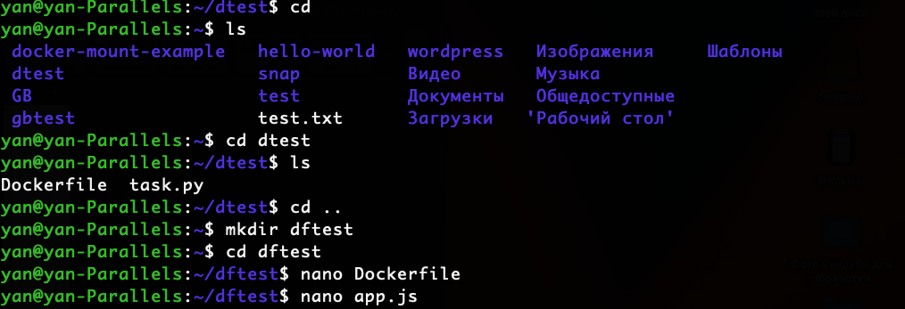
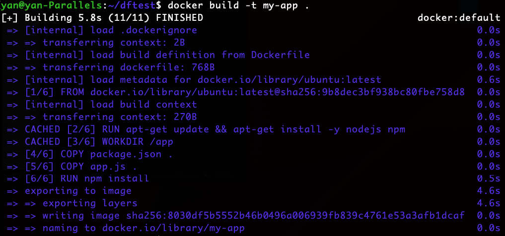
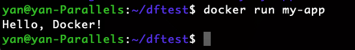

## Зоздаем файл Dockerfile

Создаем директорию dftest:
```
mkdir dftest
```
Создаем директорию Dockerfile:
```
nano Dockerfile
```
Создаем Dockerfile - пишем в реакторе nano следующий код:
```
# Используем базовый образ Ubuntu последней версии
FROM ubuntu:latest

# Установка Node.js и npm
RUN apt-get update && apt-get install -y nodejs npm

# Создание рабочей директории внутри контейнера
WORKDIR /app

# Копирование файлов приложения внутрь контейнера
COPY app.js .

# Установка зависимостей приложения
RUN npm install

# Команда, которая будет выполняться при запуске контейнера
CMD ["node", "app.js"]
```
Создаем файл в той же директории dftest app.js с кодом программы, которая будет выводить на печать "Hello, Docker":

```
nano app.js
```
Внутри файла пишем код:
```
console.log("Hello, Docker!")
```


Собираем Docker образ:
```
docker build -t my-app .
```


Запускаем контейнер на основе созданного образа:
 ```
 docker run my-app
 ```


