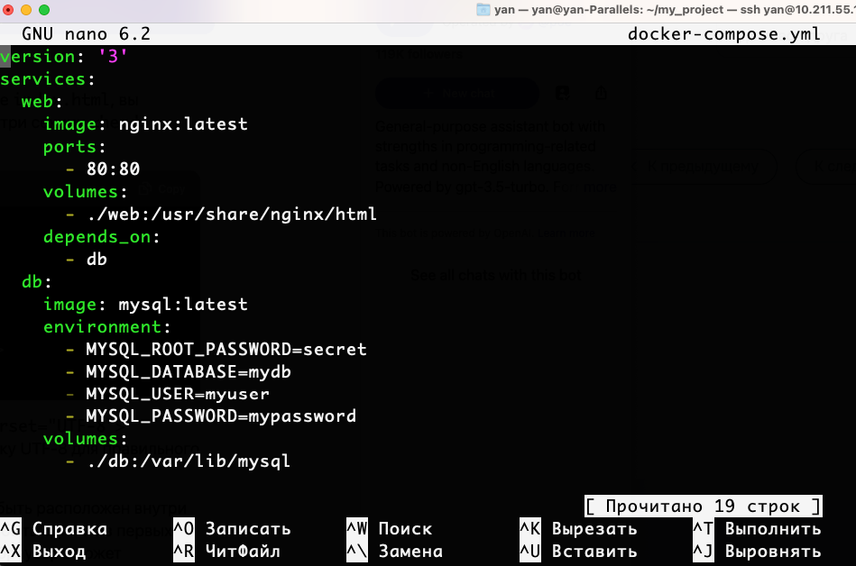

## Задача: создать сервис, состоящий из 2 различных контейнеров: 1 - веб, 2 - БД (compose)

Создаю директорию my_project:
```
mkdir my_project
```
Создаю в директории my_project файл docker-compose.yml - пишу в реакторе nano следующий код:
```
version: '3'
services:
  web:
    image: nginx:latest
    ports:
      - 80:80
    volumes:
      - ./web:/usr/share/nginx/html
    depends_on:
      - db
  db:
    image: mysql:latest
    environment:
      - MYSQL_ROOT_PASSWORD=secret
      - MYSQL_DATABASE=mydb
      - MYSQL_USER=myuser
      - MYSQL_PASSWORD=mypassword
    volumes:
      - ./db:/var/lib/mysql
```


Создаю два сервиса: web и db. Сервис web будет использовать образ Nginx,
пробрасывать порт 80 на локальную машину и монтировать локальную директорию web в контейнере
для размещения файлов веб-сервера. Сервис db будет использовать образ MySQL, задавать переменные
окружения для настройки базы данных и монтировать локальную директорию db для хранения данных БД.

В директории проекта создаю папку web. Внутри папки web создаю файл index.html, открываю в nano и добавляю в него
HTML-страницу c тайтлом "Привет мир!".

```
<!DOCTYPE html>
<html>
<head>
  <meta charset="UTF-8">
  <title>Привет, мир!</title>
</head>
<body>
  <h1>Привет, мир!</h1>
</body>
</html>
```


Запускаю сервис командой:
```
docker-compose up
```


Перехожу в браузер и открываю страницу по адресу http://localhost/


